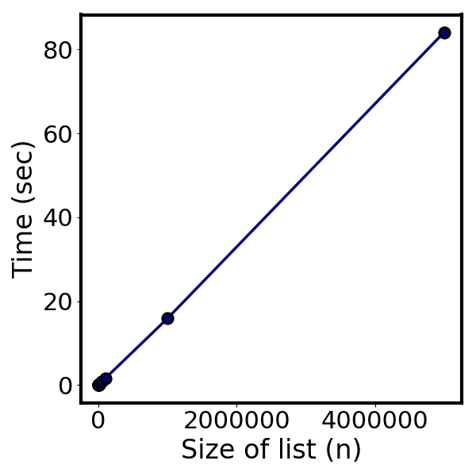
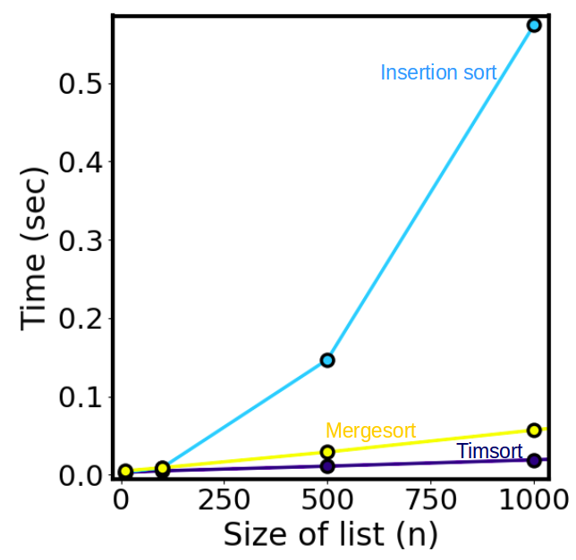

# Challenge 5: List and int sorting #

## Background ##
This program takes a list of strings containing words, integers, and non-alphanumeric characters, then outputs a sorted version of the list. Integer and word indices are treated as self-contained "bags" to be sorted; in other words, the indices containing integers are sorted, and the indices containing strings are sorted, but the final list preserves which indices contain integers and which indices contain strings. This becomes clear with an example:

`20 cat bi?rd 12 do@g >> 12 bird cat 20 dog`

For this challenge, it is safe to assume that while any element of the list may contain integers __or__ strings as well as non-alphanumeric characters, strings and integers __do not__ mix.

## Demo ##
The program can be run by executing challenge_5 py. An input and output file name must be specified as positional arguments. A sorting algorithm (one of those defined in sorting_algos.py) can be optionally specified using the -a flag. By default (in the absence of a sorting algorithm argument), Python's built-in timsort method is used.

Example with no sorting algorithm specified: `python3 challenge_5.py input.txt output.txt`

Example with sorting algorithm specified: `python3 challenge_5.py input.txt output.txt -a insertion_sort`

The file output.txt contains the expected output from running the program (and many more correct cases can be found in the test suite).

## Algorithm ##
With an eye toward time complexity, I will look at each step of the algorithm in sequence.

1. _Read in the list to be sorted from a user-specified input file_: This is __O(1)__; the file is either stored in the same directory as the script or a file path is provided by the user. 

2. _Split the space separated strings into a list of strings_: The Python core utility `split` is generally __O(n)__, where n is the character length of the string (in this case, a space separated "phrase" that this program is converting to a list).

3. _Remove non-alphanumeric characters from each component of the list_: Every character in a string of length m must be checked, and every string in a list of n strings must be checked, resulting in __O(m*n)__ complexity. Assuming the list is probably much longer than the words being checked, this is approximately O(n). 

4. _Classify each index of the list as containing an integer or a string_: Because there's no way to get around checking every element of the list, this should always be __O(n)__.

5. _Sort the integer and string lists_: The default Python sorting algorithm is [timsort](https://en.wikipedia.org/wiki/Timsort). The time complexity of timsort is a bit difficult to analyze because it is an adaptive sorting algorithm, meaning it takes advantage of order that might already exist in the input list. For the constraints of the 4-hour data challenge, I will simply state that timsort has a time complexity between __O(n)__ and __O(nlogn)__.

6. _Update the list at each position with the new value_: Getting and setting items is O(1) complexity in Python, and we perform the operation for each index of the list, making this step __O(n)__ complexity.

7. _Join the sorted list back into a space separated string and write a line to the output file._: This will end up being __O(n)__; only one line is written to the file, but the list must be condensed back into a space separated string, which is an O(n) operation.

All in all, the sorting algorithm is likely to be the bottleneck, and will be somewhere in between O(n) and O(nlogn), depending on how bad the particular sort case is. To check this reasoning, I used cProfile to time the execution of this program for a variety of different input list sizes, found in the inputs_for_timing/ folder. Note that I generated these by simply duplicating the smaller test case in input.txt, so these input files for timing do not necessarily reflect performance on lists that are truly randomly ordered (so there is room for improvement here). When using the default timsort, the program appears to be very close to the linear scaling regime:

For sport, I wanted to check a few other algorithms to demonstrate the sorting algorithm was the bottleneck. Python's timsort has a number of built-in, low-level optimization that make it very, very efficient, so I don't anticipate that anything implemented in a local module will be able to compete. Nevertheless, I wrote a mergesort and insertion_sort implementation in sorting_algos.py and ran some timing tests (see time.sh) on these as well.

Mergesort, while not much slower than timsort in this size regime, is a comparison-based sort and will show O(nlogn) behavior. Insertion sort quickly balloons to its well-known O(n2) behavior. I want to emphasize again that input files for timing are repetitions of the base input file, and more randomization would be needed to rigorously explore best/worst/average case timing.

## Testing ##
The test suite (test_suite.py) is fairly simple; it uses unittest to run through a few distinct test cases. Right now, it uses a global variable to control which sorting algorithm is tested - this is a bit hacky but I am trying to stay within the time constraints of the data challenge. Ideally the test suite should run through all available sorting algorithms when the program is being tested, but to keep the test suite fast I used a global variable while I was developing the sorting algorithms.
